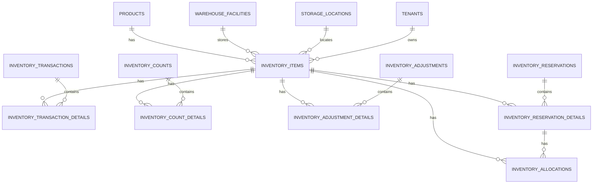

# Inventory Service Database Schema

This directory contains the database schema and migration scripts for the Inventory Service.

## Schema Overview

The inventory service manages all inventory-related data including items, transactions, counts, adjustments, and reservations. The schema is designed to support multi-tenancy and follows a microservices architecture pattern.

## Migration Files

### V1.0__inventory_schema.sql
- Creates all inventory-related tables, types, and indexes
- Sets up foreign key relationships with other services (products, facilities)
- Includes audit columns and soft delete functionality
- Implements triggers for automatic timestamp updates

## Database Tables

### Core Inventory Tables
- `inventory_policies` - Inventory control policies and settings
- `inventory_items` - Tracks individual inventory items with quantities
- `inventory_transactions` - Records all inventory movements
- `inventory_transaction_details` - Detailed line items for transactions
- `inventory_counts` - For cycle and physical inventory counts
- `inventory_count_details` - Line items for count details
- `inventory_adjustments` - Tracks inventory adjustments
- `inventory_adjustment_details` - Line items for adjustments
- `inventory_reservations` - Tracks inventory reservations
- `inventory_reservation_details` - Line items for reservations
- `inventory_allocations` - Tracks inventory allocations

### Cross-Service Dependencies
- References `products` table from Product Service
- References `warehouse_facilities`, `storage_zones`, and `storage_locations` from Facility Service
- References `tenants` table for multi-tenancy

## Usage

This schema is designed to be used with Flyway for database migrations. The migrations will be automatically applied when the inventory service starts up.

## Data Model Relationships

## Notes
- All tables include `tenant_id` for multi-tenancy support
- Soft delete is implemented via the `is_deleted` flag
- Audit columns (`created_at`, `updated_at`, `created_by`, `updated_by`) are included in all tables
- Generated columns are used for calculated fields like `quantity_available` and `total_cost`
